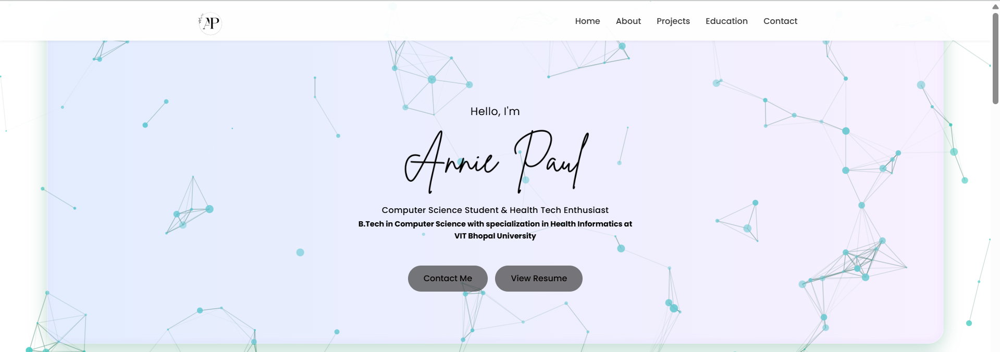

# Annie Paul Portfolio

Welcome to my personal portfolio website! This project showcases my skills, projects, certifications, and contact information in a clean, modern, and interactive design.

## Live Demo

Check out the live site here:  
[Annie Paul Portfolio](https://annecdote123.github.io/Portfolio-/)



## About

I am a Computer Science student specializing in Health Informatics, passionate about AI/ML, web development, and building innovative healthcare solutions.  
This portfolio highlights my technical skills, projects, certifications, and soft skills to showcase my journey and capabilities.

## Features

- Responsive, modern design with smooth scrolling navigation  
- Animated particle background for lively visual appeal  
- Typing effect and scroll-triggered animations for engaging user experience  
- Project showcase with interactive hover effects  
- Certifications with zoom animation  
- Skills bars that animate to show proficiency  
- Contact details with icons and links  
- Social media links and footer

## Built With

- HTML5  
- CSS3 (with CSS variables and responsive design)  
- JavaScript (for interactive animations and effects)  
- Particles.js (particle background effect)  
- Font Awesome (icons)  
- Google Fonts (Poppins font)

## Getting Started

To run this project locally, follow these steps:

1. Clone the repository  
   ```bash
   git clone https://github.com/annecdote123/Portfolio-.git
